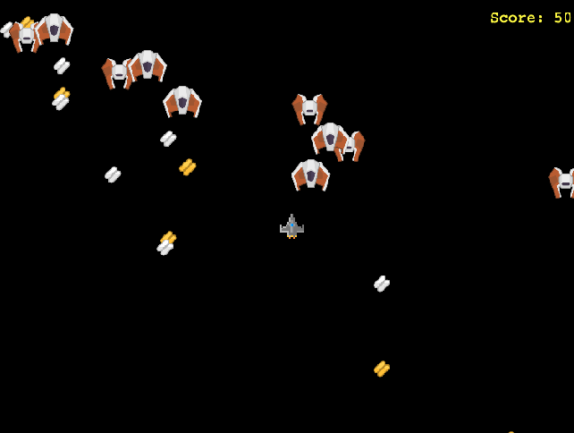
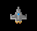
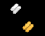
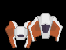
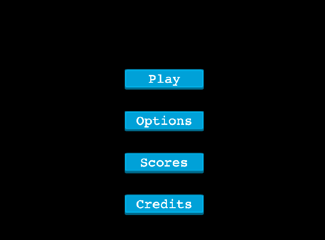
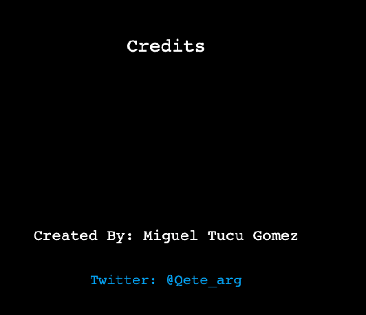
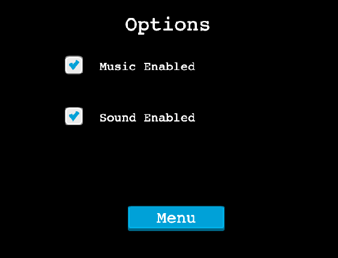
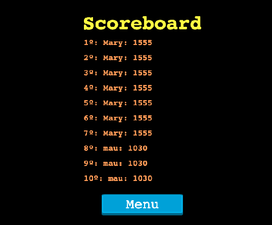
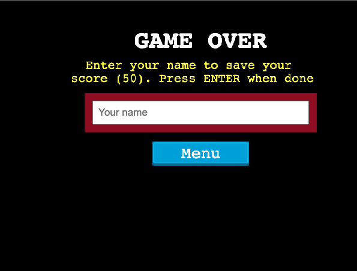

# Javascript Capstone Project : Video game

## Built With

- JavaScript ES6+
- Phaser 3
- Webpack
- HTML5/CSS3
- NPM

## Live Demo

Visit [Tucu Space Shooter](https://jovial-aryabhata-576249.netlify.app/)

## Game Design Document

### Game Logic
     The game takes place in space, bounded by the screen size of the game, where enemies and energy pills rebound when colliding to the limits. The objective is to collect as many gold ans silver energy pills as possible while not crashing with the enemyes, who fly around all over the screen

### Character

### Objects

### Location
- The space

### Mission
- Collect gold and silver energy pills

### Movements
- Player can fly up, down, left and right using the keyboard.
- Double Speed: pressing down Shift key gives a double boost up for scaping the enemies

### Energy pills
- After collecting all the pills, they re appear in the screen

### Difficulty
- Enemies are flying around trying to destroy your spaceship. Don´t let them do it!

### Scores
- Scores are optionally saved in an online server using an API
- A top ten leaderboard is integrated to the game

## Screenshots

## Prerequisites

- [Node.js](https://nodejs.org) is required to install dependencies and run scripts via `npm`.
- Internet browser compatible with HTML5, CSS3 and Javascript ES6

## Getting Started

- Open your terminal - Windows: `Win + R`, then type `cmd` | Mac: `Command + space`, then type `Terminal`
- Navigate to a directory of your choosing using the `cd` command
- Run this command in your OS terminal: `git clone git@github.com:MiguelArgentina/js-capstone-project.git` to get a copy of the project.
- Navigate to the project's directory using the `cd` command

## Using the game

After cloning the repo, run `npm install` from your project directory to install all dependencies. Then, you can start the local development server by running `npm start`.

After starting the development server with `npm start`, you can edit any files in the `src` folder and webpack will automatically recompile and reload your server (available at `http://localhost:8080` by default).

## Testing

A script for testing was added, so the user can simply run npm test from within the project's folder to execute all the tests.

## Author

👤 &nbsp; **Miguel Ricardo Gomez**

- GitHub: [@MiguelArgentina](https://github.com/MiguelArgentina)
- Twitter: [@Qete_arg](https://twitter.com/Qete_arg)
- LinkedIn: [Miguel Ricardo Gomez](https://www.linkedin.com/in/miguelricardogomez/)

 
 

  
   
   

## Show your support

Give a &nbsp;⭐️ &nbsp; if you like this project!

## Acknowledgments

- Phaser Tutorials for the [Game Template](https://phasertutorials.com/creating-a-phaser-3-template-part-1/)

- Credit "Kenney.nl" or "www.kenney.nl" for the [assets](https://opengameart.org/content/space-shooter-redux)

- York Computer Solutions LLC for the [shooter tutorial](https://learn.yorkcs.com/build-a-space-shooter-with-phaser-3/) 